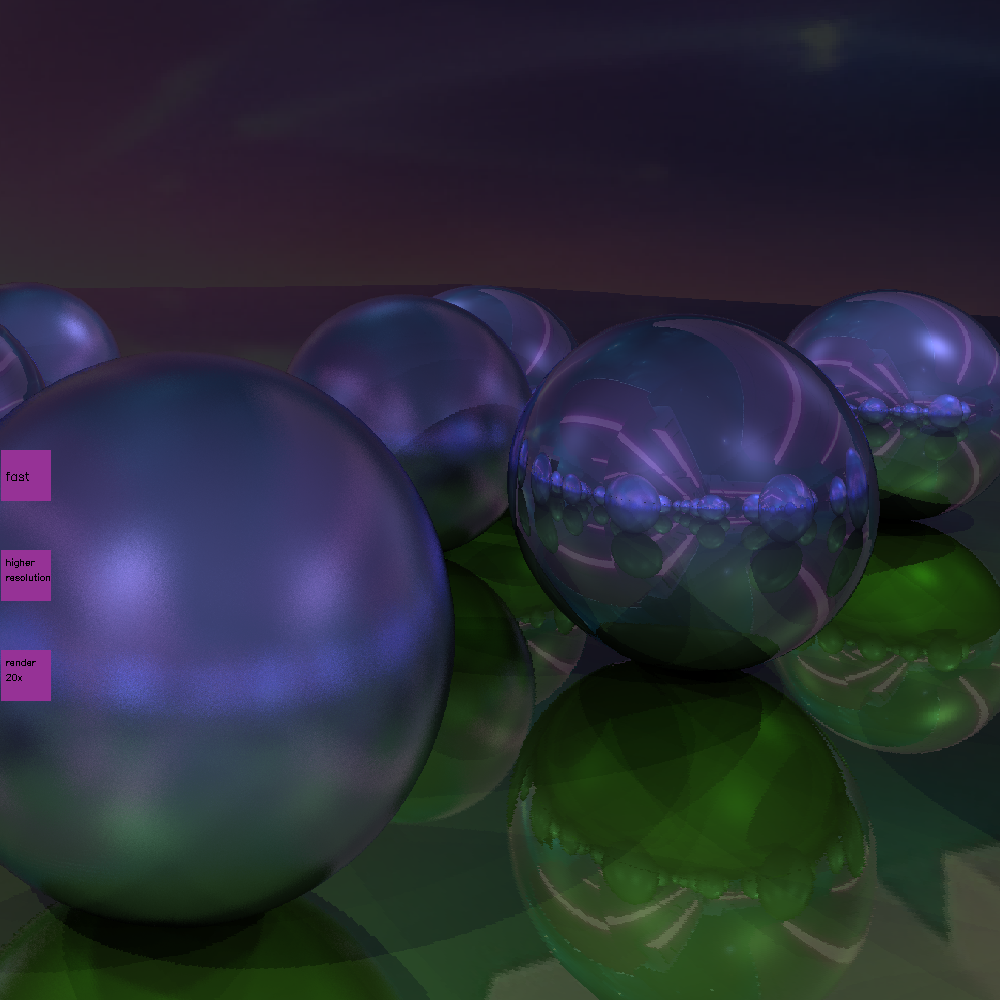
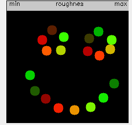
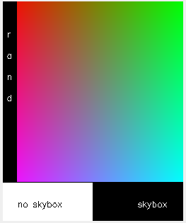
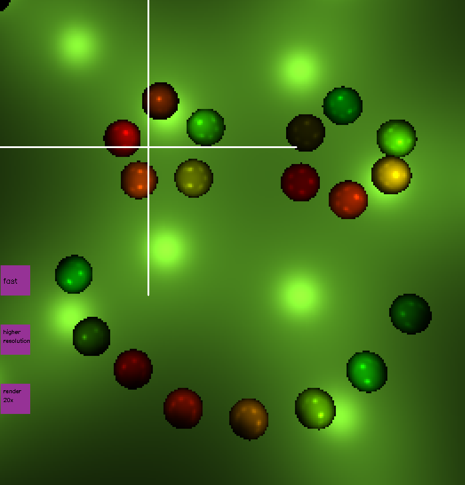
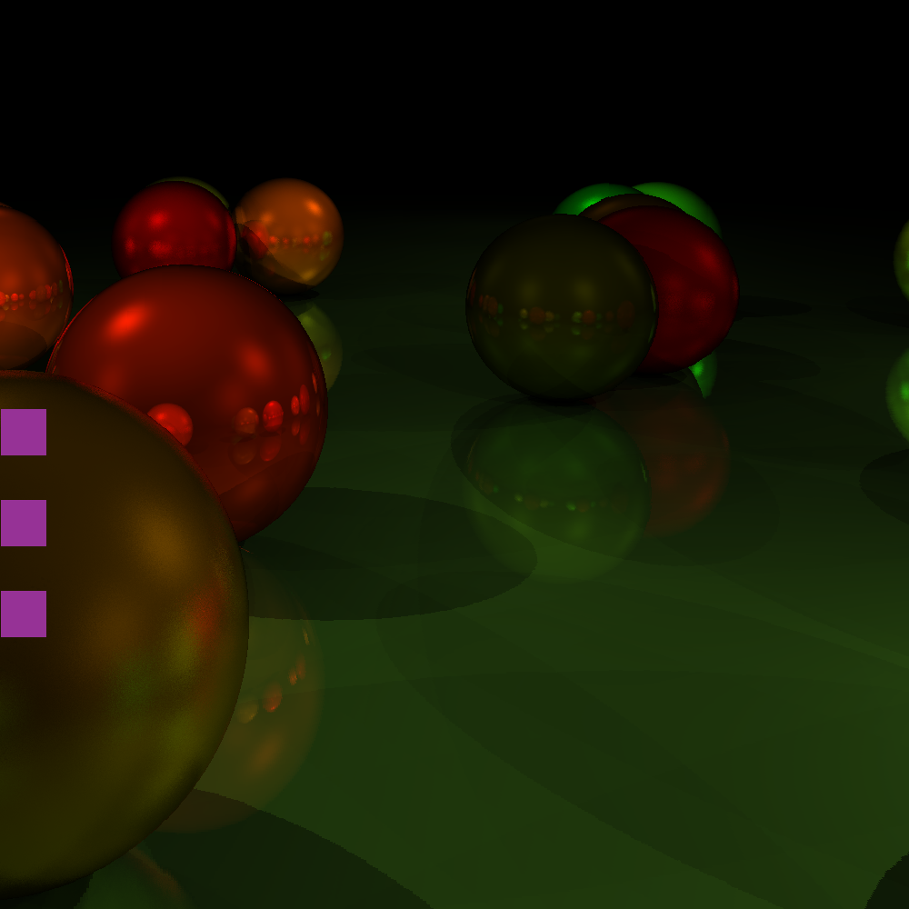

# Dreide
Welcome to dreide! Its a raytracer I implemented in C++ completely from scratch.
Its the project I learned C++ with:)

## How to use
When the program starts, there are two windows for creating the scene you see later. 

In the first window, you can add spheres by clicking. On the top, theres a grey bar where you can regulate the roughness of the sphere.

In the second window, you can select the color. On the bottom, There are two buttons to switch the skybox on and off.

Once you are done with adding spheres, press enter. A third window will appear.

It shows a first fast rendered version of the scene (not the final image).

Turn and look around by clicking on the screen (the point you click at will be moved to the center).

Move forward/ backwards by pressing f and clicking above/ below the horizontal line.

Once you are in a nice position, render the scene by pressing one of the three pink buttons.

The first one will render the scene in low resolution in about 3s.

The second one will render in high resolution in about 20s.

The third one is only needed if there are rough spheres. It renders 20 times in high resolution and calculates the mean.

This takes about 5-10min.

The skybox a well as shadows and reflection are used only when pressing the pink render buttons, not in the fast moving around mode.

## Compile
### Debian
On debian, the following opencv packages are required:
`libopencv-core-dev libopencv-imgproc-dev libopencv-highgui-dev libopencv-calib3d-dev libopencv-dnn-dev libopencv-objdetect-dev libopencv-photo-dev libopencv-stitching-dev libopencv-video-dev libopencv-imgcodecs-dev`
Also build-essential probably. Maybe more.
Compile it using make.

## the algorithm in short
From an eyepoint, rays are send through every point of the screen. If these rays hit a object, the point of intersection as well as the normal vector of the surface are calculated.
From this point, shadow rays are sent to all light sources. If no object is between the point and the light source, the brightness is calculated from the angles of incoming and outgoing ray to normal vector.
Additionally, the ray is reflected on the surface and can hit another object.  
The algorhythm above is repeated for three reflections and the total color of the pixel is calculated as sum of all the reflected light multiplied by the albedos of the objects.
For rough spheres, a small random vector is added to the direction of reflection.
If the ray does not hit a object and if during scene creation the skybox was selected, the intersection with the skybox is calculated and the color of the corresponding skybox pixel is used.

